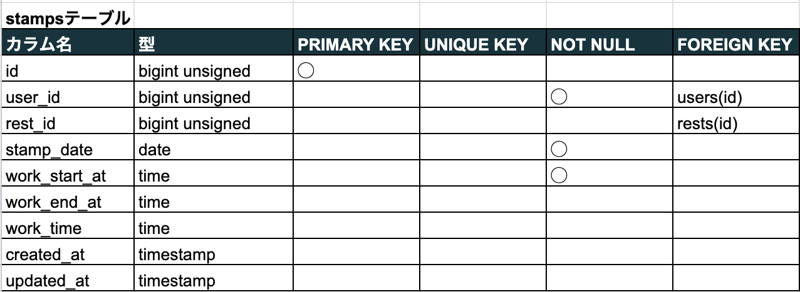
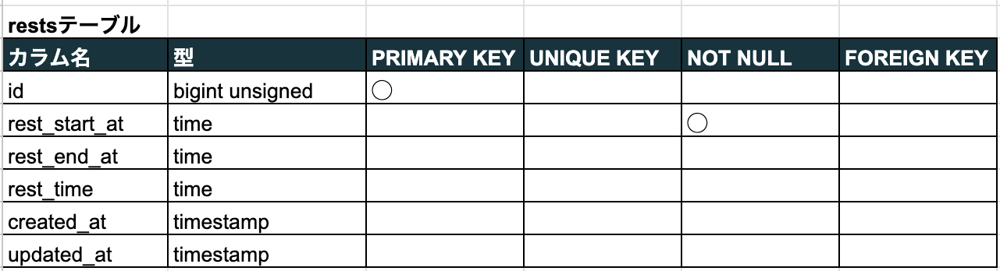

# Atte(勤怠管理システム)


## 作成した目的

人事評価のため

## アプリケーション URL

- http://mnakagawa.com/

## 機能一覧

- 会員登録
- ログイン
- ログアウト
- 勤務開始
- 勤務終了
- 休憩開始
- 休憩終了
- 日付別勤怠情報取得
- ユーザー別勤怠情報取得

## 使用技術(実行環境)

- php 7.4.9
- Laravel 8.83.8
- MySQL 8.0.26

## テーブル設計

<br>
<br>


## ER 図


# 環境構築

**Docker ビルド**

1. `git clone git@github.com:estra-inc/confirmation-test-contact-form.git`
2. DockerDesktop アプリを立ち上げる
3. `docker-compose up -d --build`

> _Mac の M1・M2 チップの PC の場合、`no matching manifest for linux/arm64/v8 in the manifest list entries`のメッセージが表示されビルドができないことがあります。
> エラーが発生する場合は、docker-compose.yml ファイルの「mysql」内に「platform」の項目を追加で記載してください_

```bash
mysql:
    platform: linux/x86_64(この文追加)
    image: mysql:8.0.26
    environment:
```

**Laravel 環境構築**

1. `docker-compose exec php bash`
2. `composer install`
3. 「.env.example」ファイルを 「.env」ファイルに命名を変更。または、新しく.env ファイルを作成
4. .env に以下の環境変数を追加

```text
DB_CONNECTION=mysql
DB_HOST=mysql
DB_PORT=3306
DB_DATABASE=laravel_db
DB_USERNAME=laravel_user
DB_PASSWORD=laravel_pass
```

5. アプリケーションキーの作成

```bash
php artisan key:generate
```

6. マイグレーションの実行

```bash
php artisan migrate
```

7. シーディングの実行

```bash
php artisan db:seed
```
